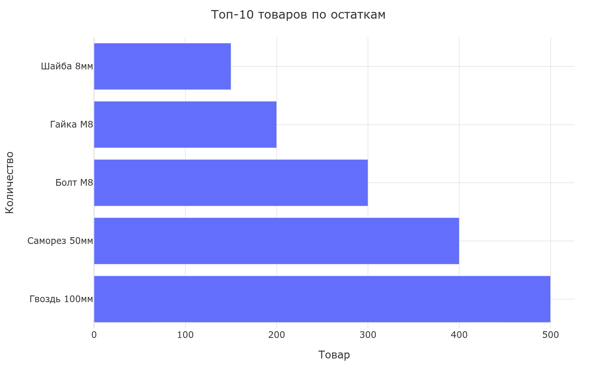
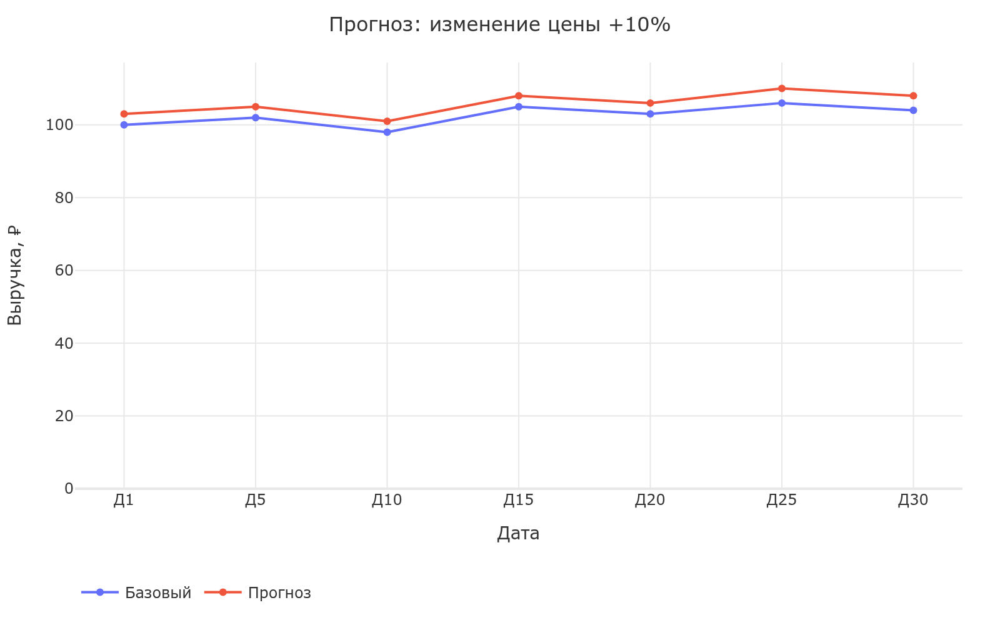
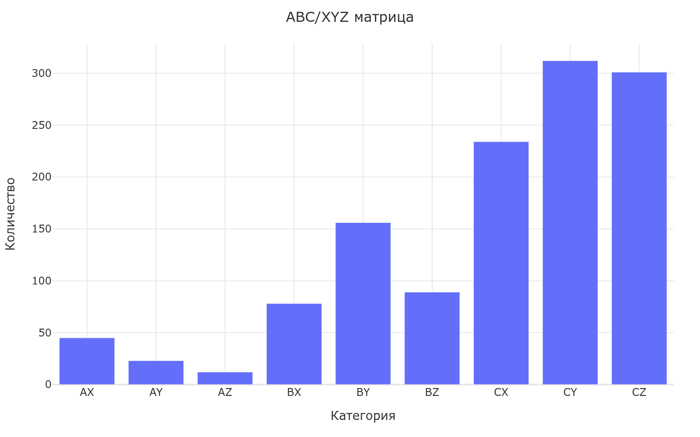

# AI-аналитик 1С + MCP + DeepSeek

AI-аналитик склада и продаж на базе 1С:УНФ, MCP и DeepSeek. Замена ручного построения отчётов на текстовые запросы, AI-инсайты, симуляцию сценариев и распознавание документов.

## 📸 Графики и визуализация

| Пример | Описание |
|--------|----------|
|  | Топ-10 товаров по остаткам (горизонтальный bar) |
|  | Прогноз выручки при изменении цены (dual line) |
|  | Распределение категорий ABC/XYZ (bar chart) |

### Страницы Web UI

| Страница | URL | Описание |
|----------|-----|----------|
| **📊 Дашборд** | `/` | Метрики, топ-10, графики |
| **📦 Остатки** | `/stock` | Поиск, фильтр, bar chart, CSV |
| **💰 Продажи** | `/sales` | Фильтры, line/pie chart |
| **💬 AI Чат** | `/chat` | Natural language запросы |
| **🔮 What-If** | `/whatif` | 4 сценария + графики Plotly |
| **📊 ABC/XYZ** | `/analysis/abc-xyz` | Матрица 3×3, Pareto |
| **🤖 Инсайты** | `/insights` | Список AI-инсайтов |
| **📄 Документы** | `/documents` | OCR + распознавание |
| **⚙️ Статус** | `/status` | Мониторинг системы |

---

## 🚀 Возможности

| Модуль | Описание |
|--------|----------|
| **📊 Анализ данных** | Остатки, продажи, задолженность, поиск номенклатуры через AI-чат |
| **📈 Auto-Charts** | Автоматическая генерация графиков (line, bar, pie, area) по запросу |
| **🔮 What-If** | Симуляция сценариев: изменение цены, акции, закупки, увольнение |
| **🤖 AI Insights** | Проактивные инсайты: аномалии продаж, дебиторка, stock-out |
| **📄 DocParser** | Распознавание накладных, счетов, УПД через OCR + AI |
| **🌐 Web UI** | FastAPI + Bootstrap 5 + Chart.js, дашборды, графики |

## 🏗️ Архитектура

```
Пользователь (CLI / Web / Telegram)
        │
        ▼
┌───────────────────┐     ┌──────────────┐
│   MCP Server      │────▶│  DeepSeek AI │
│   (8 tools)       │     │  (Function   │
│                   │◀────│   Calling)   │
└───────┬───────────┘     └──────────────┘
        │
        ▼
┌──────────────────────────────────────────┐
│              Модули                       │
│  ┌──────┐ ┌────────┐ ┌──────┐ ┌──────┐  │
│  │1С    │ │What-If │ │Инсай-│ │Доку- │  │
│  │API   │ │Simula- │ │ ты   │ │менты │  │
│  │Client│ │tor     │ │      │ │Parser│  │
│  └──────┘ └────────┘ └──────┘ └──────┘  │
└──────────────────────────────────────────┘
        │
        ▼
┌──────────────────────────────────────────┐
│           1С:УНФ / Mock Data              │
└──────────────────────────────────────────┘
```

## 📦 Установка

```bash
git clone https://github.com/Av75057/1c-mcp-sales-analyst.git
cd 1c-mcp-sales-analyst

cp .env.example .env
# Отредактировать .env: указать DEEPSEEK_API_KEY

pip install -e ".[web,dev]"
```

## 🔧 Быстрый старт

### Web UI (рекомендуется)

```bash
uvicorn web.app:app --host 0.0.0.0 --port 8000
```

Открой http://localhost:8000

| Страница | Назначение |
|----------|-----------|
| `/` | Дашборд с метриками |
| `/stock` | Остатки + поиск + график |
| `/sales` | Продажи + фильтры + графики |
| `/chat` | AI-чат с Function Calling |
| `/whatif` | Симуляция сценариев |
| `/insights` | AI-инсайты |
| `/documents` | Распознавание документов |
| `/status` | Мониторинг системы |

### CLI

```bash
python chat.py "Покажи топ-5 товаров по остаткам"
python chat.py "Что будет, если поднять цены на Гвоздь 100мм на 10%?"
```

### С мок-данными (без 1С)

```bash
USE_MOCK_DATA=true uvicorn web.app:app --host 0.0.0.0 --port 8000
```

## 🎯 Модули

### 📊 Анализ данных (MCP tools)

| Tool | Параметры | Описание |
|------|-----------|----------|
| `get_stock` | warehouse, nomenclature, min_quantity | Остатки товаров |
| `get_sales` | date_from, date_to, manager | Продажи |
| `get_sales_by_manager` | date_from, date_to | Продажи по менеджерам |
| `get_receivables` | min_amount, date_from | Задолженность |
| `list_nomenclature` | query, limit | Поиск номенклатуры |
| `create_chart` | chart_type, x_data, y_data | Графики (line/bar/pie) |

### 📈 Auto-Charts

Автоматическая генерация графиков через DeepSeek Function Calling.

```python
# AI сам решает, когда построить график
"Покажи динамику продаж за 6 месяцев"
# → get_sales → create_chart(line)
```

Поддерживаемые типы: `line`, `bar`, `hbar`, `pie`, `area`

### 🔮 What-If Simulator

Симуляция 4 сценариев с ML-моделями и Monte-Carlo:

| Сценарий | Что считает | Модель |
|----------|------------|--------|
| **💰 price_change** | Эффект изменения цены | ElasticityModel (Ridge) |
| **🏷️ promotion** | Эффект скидки + каннибализация | ElasticityModel |
| **📦 purchase_change** | Оптимизация заказа, EOQ, stock-out | MonteCarlo |
| **👤 employee_departure** | Потери при увольнении, риски | ChurnModel |

```bash
# Через Web UI: /whatif
# Или через API:
curl -X POST http://localhost:8000/api/simulate \
  -d "scenario_type=price_change&entity_name=Гвоздь 100мм&change_percent=10"
```

### 🤖 AI Insights

Проактивный анализ данных по расписанию:

| Детектор | Что ищет | Порог |
|----------|---------|-------|
| `sales_anomaly` | Падение продаж | >30% за неделю |
| `sales_growth` | Рост продаж | >25% |
| `stock_shortage` | Заканчивающиеся товары | <7 дней |
| `inactive_clients` | Неактивные менеджеры | >30 дней |
| `receivables_alert` | Рост дебиторки | >20% |

```bash
python run_insights.py scan    # разовый скан
python run_insights.py daemon  # по расписанию
```

### 📄 AI DocParser

Распознавание первичных документов:

| Формат | Обработка |
|--------|-----------|
| PDF (текст) | pdftotext |
| PDF (скан) | pdftoppm → tesseract OCR |
| JPEG/PNG | tesseract OCR |
| TXT/CSV | прямое чтение |

```bash
# Через Web UI: /documents
# Или через API:
curl -X POST http://localhost:8000/api/documents/upload \
  -F "file=@invoice.pdf" -F "match_nomenclature=true"
```

## ⚙️ Переменные окружения (.env)

| Переменная | По умолчанию | Описание |
|-----------|-------------|----------|
| `DEEPSEEK_API_KEY` | — | Ключ DeepSeek API |
| `C1_BASE_URL` | http://localhost/1c/api | URL 1С |
| `C1_USERNAME` | service_user | Логин 1С |
| `C1_PASSWORD` | service_password | Пароль 1С |
| `USE_MOCK_DATA` | true | Мок-режим (без 1С) |
| `LLM_MODEL` | deepseek-chat | Модель DeepSeek |
| `TELEGRAM_BOT_TOKEN` | — | Telegram bot token |
| `TELEGRAM_CHAT_IDS` | — | Telegram chat IDs |

## 🧪 Тестирование

```bash
# Все тесты
pytest tests/ -v

# Без графиков (требуют Chrome)
pytest tests/ --ignore=tests/test_charts.py -v

# Интеграционные тесты
pytest tests/integration/ -v
```

## 🐳 Docker

```bash
docker-compose up --build
```

## 📁 Структура проекта

```
src/
├── charts/            # Auto-Charts (Plotly engine)
├── clients/           # 1С HTTP-клиент + мок
├── docparser/         # Распознавание документов
├── insights/          # AI-инсайты (детекторы + LLM)
├── whatif/            # What-If симулятор (ML + сценарии)
├── mcp/               # MCP-сервер + tools registry
├── web/               # FastAPI Web UI
├── deepseek_client.py # DeepSeek API + Function Calling
├── tools.py           # Инструменты
└── config.py          # Конфигурация

tests/
├── test_mock_client.py
├── test_c1_client.py
├── test_deepseek_client.py
├── test_charts.py
├── test_tools.py
├── test_insights.py
└── integration/
    └── test_whatif_mcp.py

web/templates/         # Jinja2 шаблоны (7 страниц)
web/static/            # CSS/JS
```

## 📊 Технологии

| Компонент | Технология |
|-----------|-----------|
| Backend | Python 3.12, FastAPI |
| Frontend | Bootstrap 5, Chart.js, Plotly |
| ML | scikit-learn, NumPy, Pandas |
| OCR | Tesseract, pdftoppm |
| AI | DeepSeek API, Function Calling |
| Tests | pytest, pytest-asyncio |
| CI | GitHub Actions |

## 📝 Лицензия

MIT
